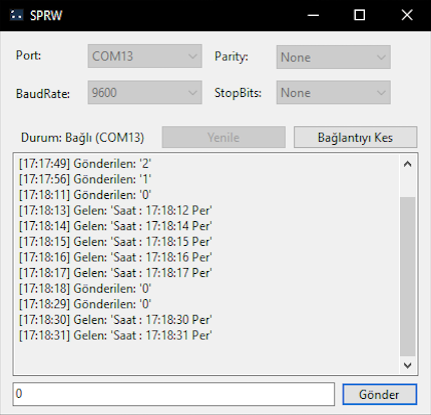

# Serial Port Read/Write

#### Arduino ve ESP8266 projelerim ile iletişime geçmek amacıyla yazdığım bir Serial Port Okuma ve Yazma aracıdır. İstediğiniz gibi düzenleyip kullanabilirsiniz.

# Ekran görüntüsü

